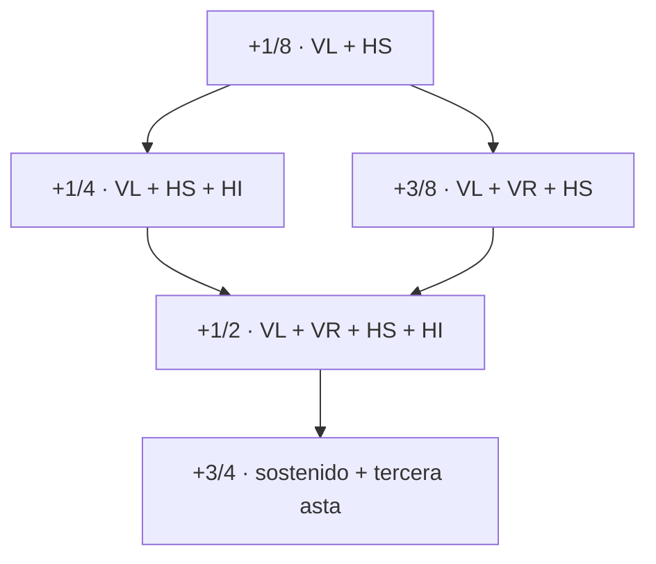

# Esferas Microtonal v0.2 — Gramática de trazos y semántica exacta

**Identificador:** EM-SPEC-021 · **Estado:** `DRAFT / NO NORMATIVO`  
**Dependencia:** [Manifiesto de diseño](./MANIFIESTO_DE_DISENO_v0.2.md)  
**Objetivo:** permitir generar y verificar glifos a partir de componentes
geométricos declarados, con **valores musicales exactos y perfiles versionados**.

## 1. Dos dominios distintos

Sea \(\mathcal G\) el conjunto de expresiones morfológicas finitas
(vectores, curvas, atributos y transformaciones).
Sea \(\mathcal I\) un conjunto de intervalos musicales, con razón de
frecuencias positiva.

Dado un **perfil explícito** \(\pi\), la interpretación musical es una
función parcial

\[
\mu_{\pi}:\mathcal G\rightharpoonup\mathcal I,
\]

que asocia una *expresión de glifo registrada* con un intervalo preciso.
La morfología no determina universalmente \(\mu_\pi\).

Si el perfil declara que **un tono equivale a 200 cents**, una alteración
descrita como \(p/q\) de tono produce

\[
c(p/q)=200\frac pq\quad \text{cents},\qquad
r(p/q)=2^{\,p/(6q)}.
\]

\(p\in\mathbb Z\), \(q\in\mathbb Z_{>0}\), reducidos por m.c.d.
**No** debe confundirse \(r(p/q)\) (razón que suele ser irracional)
con una razón de entonación justa \(a/b\) (racional).

Ejemplos exactos:

| Valor del tono | Cents exactos | Razón de frecuencias | EDO correspondiente |
| --- | ---: | --- | --- |
| +1/12 | +50/3 | \(2^{1/72}\) | 1 paso de 72-EDO |
| +1/8 | +25 | \(2^{1/48}\) | 1 paso de 48-EDO |
| +1/6 | +100/3 | \(2^{1/36}\) | 1 paso de 36-EDO, 2 de 72-EDO |
| +1/4 | +50 | \(2^{1/24}\) | 1 paso de 24-EDO |
| +3/8 | +75 | \(2^{1/16}\) | 3 pasos de 48-EDO |
| +1/2 | +100 | \(2^{1/12}\) | 1 paso de 12-EDO |
| +3/4 | +150 | \(2^{1/8}\) | 3 pasos de 24-EDO |

La inversión musical de una alteración de cents \(c\) es la de
\(-c\). Esta operación **no impone** reflexión horizontal automática
del dibujo: el bemol y sostenido pertenecen a dos familias distintas.

## 2. Inventario de primitivas

### Sostenido \(\sharp\)

| Token | Definición geométrica | Función |
| --- | --- | --- |
| `V_L` | Asta vertical izquierda | Base de la familia ascendente |
| `V_R` | Asta vertical derecha | Incremento del sostenido completo |
| `H_S` | Travesaño superior, ligeramente inclinado | Parte superior de la lectura |
| `H_I` | Travesaño inferior, paralelo al superior | Completa doble travesaño |
| `V_X` | Tercera asta extraordinaria | Candidato de +3/4; no se usa en 1/2 |

Los tokens representan **trazos vectoriales**, no superficies negras
planas ni paths extraídos de una fuente existente. El trazado exacto
se definirá en fuentes editables para la v0.2.

### Bemol \(\flat\)

| Token | Definición |
| --- | --- |
| `B_V` | Asta principal |
| `B_CURVE_R` | Panza abierta a la derecha |
| `B_CURVE_L` | Panza abierta a la izquierda |
| `B_OPEN` | Política de contraforma abierta, sin relleno |

`B_CURVE_R` y `B_CURVE_L` no son intercambiables: el punto
de unión, la tensión, la inflexión y el lado de la panza deben ser
ópticamente correctos. Un espejo matemático exacto puede requerir
correcciones tipográficas posteriores.

### Becuadro \(\natural\)

| Token | Definición |
| --- | --- |
| `N_VL` | Asta izquierda extendida hacia arriba |
| `N_VR` | Asta derecha prolongada hacia abajo |
| `N_HS` | Travesaño superior oblicuo que une las astas |
| `N_HI` | Travesaño inferior oblicuo, separado del superior |

Invariantes visuales: dos astas **desfasadas verticalmente**, dos
travesaños con compensación oblicua, contraformas abiertas y ausencia
de bloque rectangular negro. La función de cancelación del becuadro
depende del contexto notacional; **no es un operador acústico cero
independiente del nombre de nota**.

## 3. Operadores morfológicos

Definimos formalmente las operaciones de una gramática tipográfica:

- \(\operatorname{DEL}(t,g)\): elimina el token \(t\) de \(g\),
  si está presente;
- \(\operatorname{ADD}(t,g)\): incorpora \(t\), si no existe;
- \(\operatorname{REFLECT}_x(g)\): refleja alrededor de un eje de
  composición determinado;
- \(\operatorname{TRIM}(t,\lambda,g)\): acorta o prolonga un token
  de manera controlada;
- \(\operatorname{OPT}(g)\): aplica correcciones **puramente ópticas**;
- \(\operatorname{DRAW}(g,\rho)\): realiza glifos en una pauta con
  métricas \(\rho\) (unidad, avance, anclajes).

La evaluación es parcial: no todas las composiciones conducen a
glifos válidos. `OPT` no debe alterar la identidad semántica
del glifo, aunque cambie sus medidas.

## 4. Familia ascendente: retícula de subconjuntos

El sostenido ordinario se abstrae como:

\[
S_{1/2}=\{V_L,V_R,H_S,H_I\}.
\]

Los ejemplos planteados por el autor (+1/8, +1/4 y +3/4) y una **hipótesis técnica adicional para +3/8, no aprobada todavía**, conducen a:

\[
\begin{aligned}
S_{1/8}&=\{V_L,H_S\}\\
S_{1/4}&=\{V_L,H_S,H_I\}
 =\operatorname{DEL}(V_R,S_{1/2})\\
S_{3/8}&=\{V_L,V_R,H_S\}
 =\operatorname{DEL}(H_I,S_{1/2})\\
S_{1/2}&=\{V_L,V_R,H_S,H_I\}\\
S_{3/4}&=S_{1/2}\cup\{V_X\}.
\end{aligned}
\]

Esto define una **retícula parcial**, no una cadena total:



Consecuencias matemáticas:

- \(S_{1/8}\subset S_{1/4}\) y \(S_{1/8}\subset S_{3/8}\);
- \(S_{1/4}\not\subset S_{3/8}\) y
  \(S_{3/8}\not\subset S_{1/4}\);
- el **número de trazos** no ordena estrictamente los intervalos:
  \(|S_{1/4}|=|S_{3/8}|=3\);
- la unión de conjuntos **no representa adición de intervalos**:
  \(S_{1/8}\cup S_{1/8}=S_{1/8}\), aunque
  \(25+25=50\) cents.

Por tanto **NO existe** un homomorfismo aditivo de
\((\mathcal P(\{V_L,V_R,H_S,H_I\}),\cup)\) al grupo aditivo
de cents que envíe \(S_{1/8}\) a 25 cents, pues
\(\mu(A\cup A)=\mu(A)\) pero
\(\mu(A)+\mu(A)=50\neq25\).

La asociación tonal de los signos es una **tabla de interpretación**
registrada (\(\mu_\pi\)), no una suma de trazos.

### Estados históricos

- `S_1/4`: el medio sostenido Stein–Zimmermann,
  SMuFL `accidentalQuarterToneSharpStein` (`U+E282`).
- `S_1/2`: sostenido convencional `accidentalSharp` (`U+E262`).
- `S_3/4`: contrastar con
  `accidentalThreeQuarterTonesSharpStein` (`U+E283`).
- `S_1/8` y `S_3/8`: **hipótesis gráficas de trabajo**;
  no denominarlas signos históricos universalmente estandarizados.

La correspondencia **semántica** `3/4 → E283` está registrada en SMuFL;
el **dibujo con tercera asta** debe compararse cuidadosamente con la
variante histórica elegida, en vez de suponerse idéntico por el código.

## 5. Familia descendente: invariantes y tareas pendientes

Partimos de `B_flat = {B_V, B_CURVE_R, B_OPEN}`
y `B_quarter = {B_V, B_CURVE_L, B_OPEN}`.

Se normalizan funcionalmente:

- \(-1/2\) tono → `accidentalFlat`, `U+E260`;
- \(-1/4\) tono → `accidentalQuarterToneFlatStein`,
  `U+E280`: **bemol inverso abierto**.

No queda demostrada ni aprobada una gramática para \(-1/8\),
\(-3/8\), \(-3/4\), \(-1/6\) o \(-1/12\).
Suprimir un segmento de panza o añadir una pequeña rama será objeto
de bocetos e identificación rigurosa de antecedentes.

**Invariante prioritario:** nunca convertir el bemol inverso abierto
en el signo relleno `accidentalQuarterToneFlatFilledReversed`
(`U+E480`); son glifos distintos.

## 6. Sextos y doceavos: problema de densidad de información

Si un conjunto de trazos debe codificar valores \(c\) para
subdivisiones de 12, 8, 6, 4 y 2, la representación debe cubrir:

\[
\{50/3,25,100/3,50,75,100,150\}\ \mathrm{cents}
\]

en una misma orientación, más signos descendentes. La distancia más
pequeña entre los valores presentes es \(25-50/3=25/3\) cents.
**Este hecho matemático no garantiza** que podamos distinguir sus glifos
a escala impresa. El límite lo impone la percepción gráfica, no la
granularidad acústica.

Las propuestas de \(\pm1/6\) y \(\pm1/12\) deben reservar
mecanismos claros de composición óptica, sin fracciones diminutas
imposibles de leer ni símbolos gruesos arbitrarios.

## 7. Esquema de datos propuesto (no código ejecutable)

Cada signo quedará registrado con estos campos:

```json
{
  "id": "esferas.accidental.eighth.up",
  "status": "candidate",
  "system": "tone-12tet",
  "tone_fraction": {"numerator": 1, "denominator": 8},
  "cents_exact": {"numerator": 25, "denominator": 1},
  "base_family": "sharp",
  "stroke_set": ["V_L", "H_S"],
  "operator": ["DEL:V_R", "DEL:H_I"],
  "smufl_name": null,
  "codepoint": null,
  "fallback": "octavo de tono ascendente (+25 cents)"
}
```

El código de carácter permanece `null` **hasta** adoptar un esquema
de registro que evite colisiones. La v0.1 utiliza códigos provisionales
`U+F0001…U+F0006`, pero ni estos ni un código privado nuevo representan
una inscripción automática en el estándar SMuFL.

## 8. Métricas y parámetros de grabado

**Referencia de diseño:** `UPM = 1000`, un espacio entre líneas de la
pauta `s = 250` unidades. Estos parámetros son provisionales y deben
contrastarse con una fuente musical profesional sin copiar sus outlines.

| Propiedad | Intervalo de diseño inicial | Comentario |
| --- | --- | --- |
| Trazo principal | `0.08s–0.12s` | En UPM1000, 20–30 unidades |
| Trazo secundario | `0.055s–0.09s` | 14–23 unidades aproximadas |
| Altura general de alteraciones | `2.0s–3.1s` | Depende de la especie; no una escala fija |
| Separación glifo–cabeza | objetivo `≥0.20s` | Verificar también anclajes |
| Cuerpos macizos autónomos | **evitar** | Mantener contraformas abiertas |

Los rangos son **hipótesis verificables**, no declaraciones de cumplimiento.
El propósito es adelgazar claramente la v0.1 (trazos de hasta 46–64
unidades), sin perder detalles por *hinting* o antialiasing.

No se copiarán las métricas de Leland ni Bravura: sus medidas solo sirven
para el cotejo tipográfico de resultados.

## 9. Contrato para implementación

`build_font.py` **no** se modifica por la mera aprobación de este texto.
Una futura implementación v0.2 deberá:

1. definir `s` y tokens en un único módulo paramétrico;
2. generar cada glifo como árbol de operaciones sobre sus primitivas;
3. aplicar correcciones ópticas **después** de resolver la morfología;
4. incluir contornos abiertos, cajas y anclajes auditables;
5. serializar valores semánticos con enteros/fracciones exactas;
6. demostrar que los signos de la retícula ascendente se reconstruyen
   de forma reproducible a partir del sostenido base;
7. no inventar equivalencias acústicas por semejanza visual;
8. comparar los glifos a tamaño impreso, no solo a 112 px;
9. conservar identificadores SMuFL correctos para convenciones conocidas;
10. publicar únicamente después de QA visual y aprobación explícita.

**Estado final de este documento: especificación de trabajo, no una
fuente entregada ni un estándar ratificado.**
